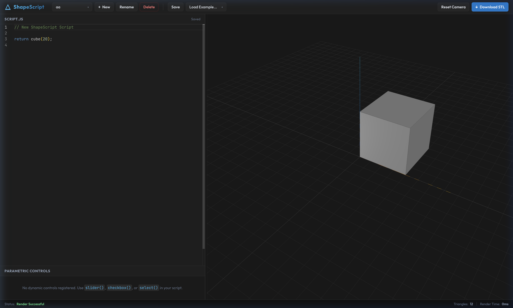
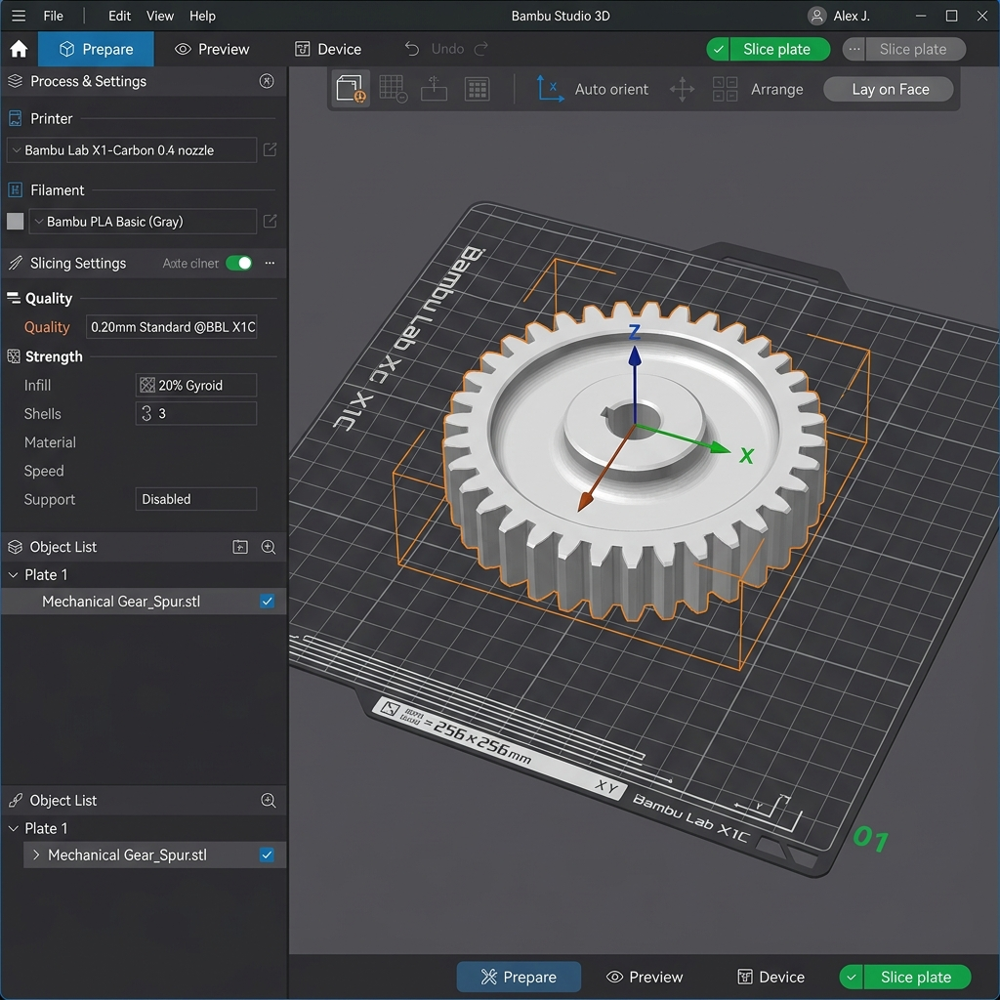

# ShapeScript

ShapeScript is a 100% client-side, offline-first CAD modeling environment that lets you write JavaScript to generate 3D solid models and export them as binary STL files for 3D printing.

## Screenshots

### 1. ShapeScript CAD Editor
Below is the web interface of ShapeScript featuring the Monaco code editor on the left, live parametric sliders, and the Three.js viewport on the right rendering the 3D model:



### 2. Exported Model inside Bambu Studio
Below is the binary STL exported from ShapeScript imported on the build plate of Bambu Studio, showing the exact teeth geometries ready to slice and print:



---

## Features

- **Pure JavaScript Scripting:** No UI drag-and-drop. Write code to model procedurally.
- **Constructive Solid Geometry (CSG):** Form complex shapes using `union()`, `subtract()`, and `intersect()` Boolean operations.
- **Isolated Thread Execution:** User code runs inside a Web Worker. If you make a syntax error or trigger an infinite loop, the worker is terminated to prevent browser freezing.
- **Debounced Rendering:** Triggers rebuild 2000ms after you stop typing to ensure a smooth editing experience.
- **Parametric Inputs:** Declare variables using `slider()`, `checkbox()`, or `select()` to draw dynamic controls in the UI panel. Adjusting them rebuilds the geometry instantly without code changes.
- **LocalStorage Storage System:** Auto-saves your scripts locally. Supports creating, deleting, and renaming files.
- **Examples Library:** Bootstrapped with 8 examples, including a custom Phone Stand, Gear Maker, wall peg Hook, and Knob.
- **Binary STL Export:** Compiles triangles into a compact binary format ready for all common slicers (Cura, PrusaSlicer, Bambu Studio).

---

## Local Setup & Development

Follow these steps to run ShapeScript on your machine:

1. **Clone and Install Dependencies:**
   ```bash
   npm install
   ```

2. **Start the Development Server:**
   ```bash
   npm start
   ```
   Open your browser to `http://localhost:3000` to access the editor.

3. **Build for Production:**
   ```bash
   npm run build
   ```
   This compiles and minifies the assets into the `dist/` directory.

---

## ShapeScript API Reference

### Primitives
- `cube(size)` or `cube(w, d, h)` (aligned in positive octant)
- `box(w, d, h)` (alias for `cube`)
- `sphere(radius)` (centered at origin)
- `cylinder(radius, height)` (centered on XY, positive Z)
- `cone(radiusTop, radiusBottom, height)`
- `torus(radius, tubeRadius)`

### Chainable Transformations
- `.move(x, y, z)`: Shift coordinates.
- `.rotate(x, y, z)`: Rotate around axes in **degrees**.
- `.scale(sx, sy, sz)`: Scale geometry.
- `.mirror(axis)`: Mirror across `'x'`, `'y'`, or `'z'` plane.

### Boolean Operations
- `union(...objects)`
- `subtract(base, ...objects)`
- `intersect(...objects)`

### Parametric Inputs
- `slider(name, defaultValue, min, max)`
- `checkbox(name, defaultValue)`
- `select(name, defaultValue, optionsArray)`
