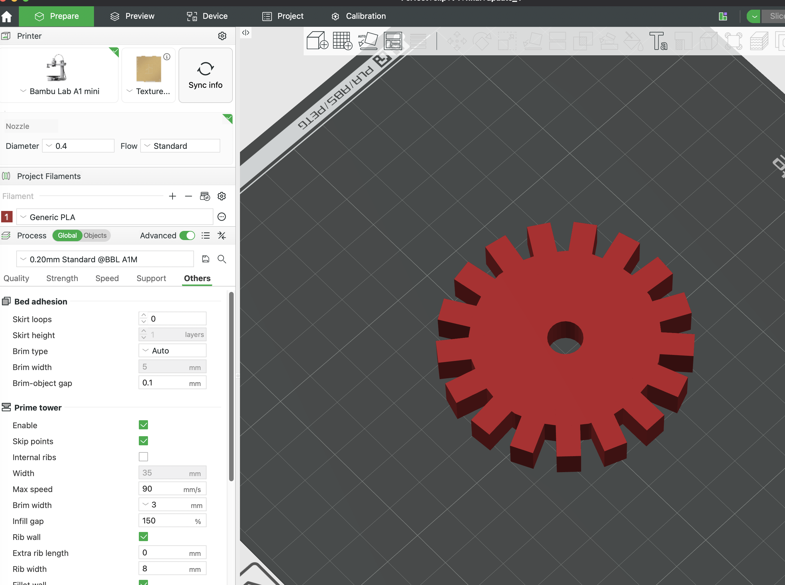

# ShapeScript

ShapeScript is a 100% client-side, offline-first CAD modeling environment that lets you write JavaScript to generate 3D solid models and export them as binary STL files for 3D printing.

## Screenshots

### 1. ShapeScript CAD Editor
Below is the web interface of ShapeScript featuring the Monaco code editor on the left, live parametric sliders, and the Three.js viewport on the right rendering the 3D model:


### 2. Exported Model inside Bambu Studio
Below is the binary STL exported from ShapeScript imported on the build plate of Bambu Studio, showing the exact teeth geometries ready to slice and print:



---

## Features

- **Pure JavaScript Scripting:** No UI drag-and-drop. Write code to model procedurally.
- **Constructive Solid Geometry (CSG):** Form complex shapes using `union()`, `subtract()`, and `intersect()` Boolean operations.
- **Isolated Thread Execution:** User code runs inside a Web Worker. If you make a syntax error or trigger an infinite loop, the worker is terminated to prevent browser freezing.
- **Debounced Rendering:** Triggers rebuild 2000ms after you stop typing to ensure a smooth editing experience.
- **Parametric Inputs:** Declare variables using `slider()`, `checkbox()`, or `select()` to draw dynamic controls in the UI panel. Adjusting them rebuilds the geometry instantly without code changes.
- **LocalStorage Storage System:** Auto-saves your scripts locally. Supports creating, deleting, and renaming files.
- **Examples Library:** Bootstrapped with 8 examples, including a custom Phone Stand, Gear Maker, wall peg Hook, and Knob.
- **Binary STL Export:** Compiles triangles into a compact binary format ready for all common slicers (Cura, PrusaSlicer, Bambu Studio).
- **AI Assistant (DeepSeek):** Describe a model in plain English ("a phone stand at 60 degrees") or ask for a change to the current script ("add a knob on the drawer") and the assistant writes/edits the ShapeScript for you. It can also auto-fix a failing render.

---

## AI Assistant

ShapeScript includes an optional in-app assistant powered by [DeepSeek](https://platform.deepseek.com/).

It lives in the **AI Assistant** panel below the editor and supports three actions:

- **Generate** — create a brand-new model from a natural-language description.
- **Modify** — apply a change to the script currently in the editor.
- **Fix Error** — when a render fails, send the code + error to the AI for a fix (enabled only while there is an error).

The DeepSeek API key is held **server-side only** — a small Express server proxies requests so the key never reaches the browser.

> ⚠️ The AI endpoint is currently **public with no authentication**. It is rate-limited (20 requests / 15 min per IP), but exposing it publicly can incur DeepSeek API costs. Add authentication before deploying it widely.

### Configure the key

```bash
cp .env.example .env
# then edit .env and set DEEPSEEK_API_KEY=sk-...
```

---

## Local Setup & Development

Follow these steps to run ShapeScript on your machine:

1. **Clone and Install Dependencies:**
   ```bash
   npm install
   ```

2. **Configure the AI key (optional, for the assistant):**
   ```bash
   cp .env.example .env   # then set DEEPSEEK_API_KEY
   ```

3. **Start the Development Servers (Vite + API together):**
   ```bash
   npm run dev
   ```
   Open your browser to `http://localhost:3000`. Vite (port 3000) proxies `/api` to the Express
   server on port `3002`, so the AI assistant works in dev. (Use `npm run dev:web`
   or `npm run dev:api` to run them individually.)

4. **Build for Production:**
   ```bash
   npm run build
   ```
   This compiles and minifies the assets into the `dist/` directory.

5. **Run the Production Server (serves `dist/` + the AI API):**
   ```bash
   npm start
   ```
   Express serves the built SPA and `/api/ai/chat` on `PORT` (default `3001`).

---

## Deployment (Docker → Google Cloud Run)

The app ships as a **single container**: one Express process serves the static SPA
and the AI proxy.

```bash
# Build the image
docker build -t shapescript .

# Run locally (provide the key at runtime)
docker run -p 3001:3001 -e DEEPSEEK_API_KEY=sk-... shapescript

# Deploy to Cloud Run (key from Secret Manager — never baked into the image)
gcloud run deploy shapescript \
  --source . \
  --set-secrets DEEPSEEK_API_KEY=deepseek-key:latest \
  --allow-unauthenticated
```

Cloud Run injects the `PORT` env var (typically `8080`); the server reads it
automatically. `GET /health` is provided for startup/liveness probes.

---

## ShapeScript API Reference

### Primitives
- `cube(size)` or `cube(w, d, h)` (aligned in positive octant)
- `box(w, d, h)` (alias for `cube`)
- `sphere(radius)` (centered at origin)
- `cylinder(radius, height)` (centered on XY, positive Z)
- `cone(radiusTop, radiusBottom, height)`
- `torus(radius, tubeRadius)`

### Chainable Transformations
- `.move(x, y, z)`: Shift coordinates.
- `.rotate(x, y, z)`: Rotate around axes in **degrees**.
- `.scale(sx, sy, sz)`: Scale geometry.
- `.mirror(axis)`: Mirror across `'x'`, `'y'`, or `'z'` plane.

### Boolean Operations
- `union(...objects)`
- `subtract(base, ...objects)`
- `intersect(...objects)`

### Parametric Inputs
- `slider(name, defaultValue, min, max)`
- `checkbox(name, defaultValue)`
- `select(name, defaultValue, optionsArray)`
